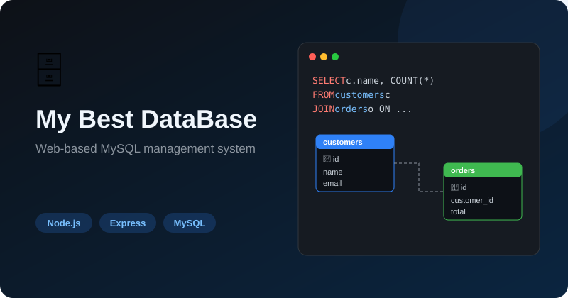
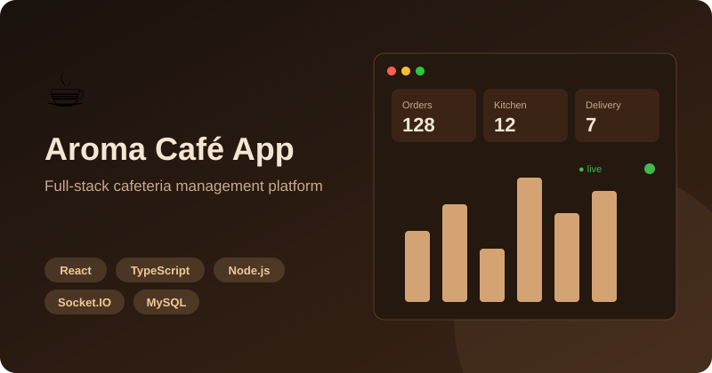
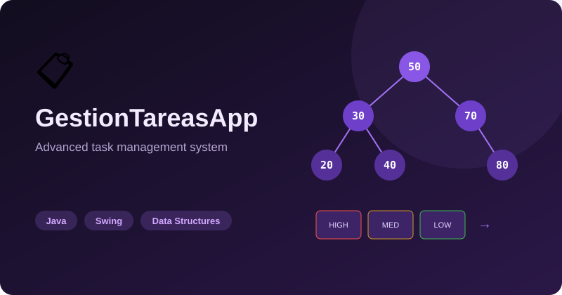
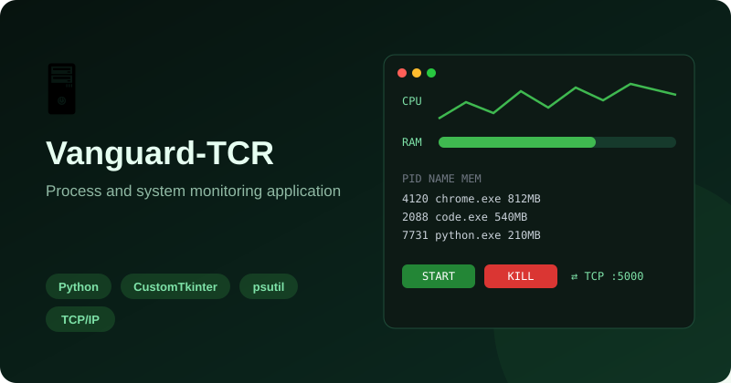
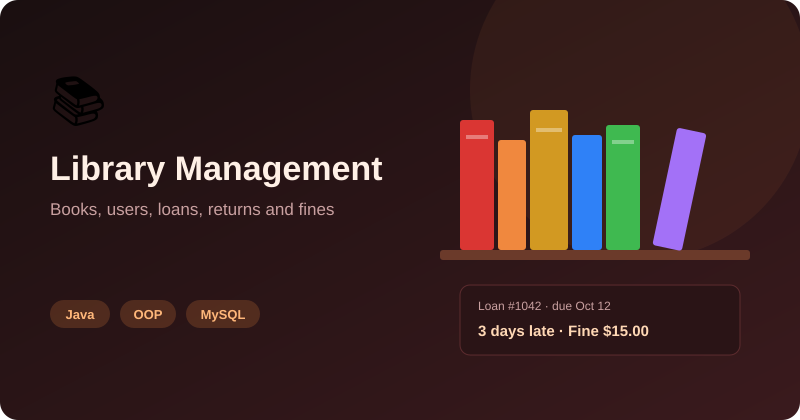

<!-- INICIO DEL ENCABEZADO -->
<p align="center">
  
</p>
<!-- FINAL DEL ENCABEZADO -->
<p align="center">
  Software Engineering Student · Software Developer · Full-Stack in Progress
</p>
<H1 align="center">
  ABOUT ME
</H1>
I'm a Software Engineering student focused on building complete software solutions, from application logic and data structures to databases, APIs and web interfaces.

I enjoy turning ideas into functional applications and continuously improving the architecture, usability and technical quality of my projects.

---
<H1 align="center">
  Languages & Tools
</H1>
<p align="center">
  <a href="https://skillicons.dev">
    
  </a>
</p>


<H1 align="center">
  Currently Learning
</H1>

<p align="center">
  <a href="https://skillicons.dev">
    
  </a>
</p>

---
<H1 align="center">
  Areas of Interest
</H1>

* Backend Development
* Full-Stack Development
* Database Design
* Software Architecture
* Object-Oriented Programming
* Data Structures & Algorithms
* REST APIs
* Distributed Applications
* Data Analysis
* Cloud Technologies

---
<H1 align="center">
  🎯 Current Focus 🎯
</H1>
I'm currently focused on moving from local and desktop applications toward more complete **web and cloud-based systems**.

My current learning path includes:

```text
Java / Python
      ↓
Data Structures & Algorithms
      ↓
SQL & Database Design
      ↓
Backend Development
      ↓
REST APIs
      ↓
Spring Boot / Node.js
      ↓
React
      ↓
Docker & Linux
      ↓
Cloud / AWS
```

The goal is to progressively build applications with stronger architecture, scalability, security and deployment practices.

---
<H1 align="center">
  Featured Projects
</H1>

### 🗄️ My Best DataBase

**Web-based MySQL database management system**

A full-stack application inspired by database management environments such as MySQL Workbench.

<p align="center">
  
</p>

**Stack:** `Node.js` · `Express` · `JavaScript` · `HTML` · `CSS` · `MySQL`

🔗 **[View Repository](https://github.com/CalixtoIsaac/My-Best-DataBase)**

---

### ☕ Aroma Café App

**Full-stack cafeteria management platform**

A complete application designed to manage a cafeteria's menu, orders, inventory, employees and deliveries.

**Stack:** `React` · `TypeScript` · `Node.js` · `Express` · `MySQL` · `Socket.IO` · `Vite`

<p align="center">
  
</p>

🔗 **[View Repository](https://github.com/CalixtoIsaac/Aroma-Cafe-App)**

---

### 📋 GestionTareasApp

**Advanced task management system**

A Java application focused on applying data structures and algorithms to a practical business scenario.

**Stack:** `Java` · `Swing` · `Data Structures` · `Algorithms`

<p align="center">
  
</p>

🔗 **[View Repository](https://github.com/CalixtoIsaac/Gestor-de-tareas-TaskFlow-)**

---

### 🖥️ AdminProcesosPC / Vanguard-TCR

**Process and system monitoring application**

A Python-based system administration project designed to monitor and manage processes running on a computer.

**Stack:** `Python` · `CustomTkinter` · `psutil` · `TCP/IP`

<p align="center">
  
</p>

🔗 **[View Repository](https://github.com/RyuuJS1/Vanguard-TCR)**

---

### 📚 Library Management System

**Java library management application**

A complete management system developed around object-oriented programming and database concepts.

**Stack:** `Java` · `OOP` · `MySQL` · `SQL`

<p align="center">
  
</p>

🔗 **[View Repository](https://github.com/CalixtoIsaac/ProyectoBiblioteca)**

---

## 📫 Let's Connect

I'm always interested in learning, building new projects and connecting with other developers.

**LinkedIn:** [linkedin.com/in/calixto-isaac](https://www.linkedin.com/in/calixto-isaac)

**Email:** [calixtoisaacgaleanamedrano@gmail.com](mailto:calixtoisaacgaleanamedrano@gmail.com)

**GitHub:** [github.com/CalixtoIsaac](https://github.com/CalixtoIsaac)

---

### 💻 If you can imagine it, you can program it.
